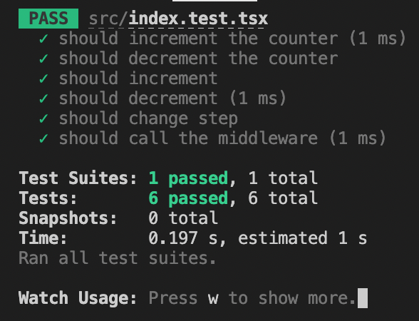

# AH

# Overview

This project uses some React and Redux feature to keep a counter running, it can run using a plain old javascript interval timer or by user interaction, the state is kept in Redux and the step can be configured by choosing the proper value in the web ui.

Some of the changes implemented:
- The autoincrement timer only works up to 10
- If the counter goes below 0 the timer decrements it
- If the counter reaches 20 it shows an alert
- The variables has been replaced by more meaning names
- The global font family was changed to monospace
- Timestamp is logged to console when the component is mounted
- Units testes were created to test redux related functions.

Other important remarks
- The original file was splitted in 3 to make testing simpler.
  -- src/
  ------ [App.tsx](src/App.tsx): Main component
  ------ [store.tsx](src/store.tsx) : Redux Objects
  ------ [index.tsx](src/index.tsx) : Main React file

Test:
- Test are in file (src/index.test.tsx)
  

# Demo
This project is deployed at 

## Available Scripts

In the project directory, you can run:

### `npm start`

Runs the app in the development mode.\
Open [http://localhost:3000](http://localhost:3000) to view it in the browser.

The page will reload if you make edits.\
You will also see any lint errors in the console.

### `npm test`

Launches the test runner in the interactive watch mode.\
See the section about [running tests](https://facebook.github.io/create-react-app/docs/running-tests) for more information.

### `npm run build`

Builds the app for production to the `build` folder.\
It correctly bundles React in production mode and optimizes the build for the best performance.

The build is minified and the filenames include the hashes.\
Your app is ready to be deployed!

See the section about [deployment](https://facebook.github.io/create-react-app/docs/deployment) for more information.